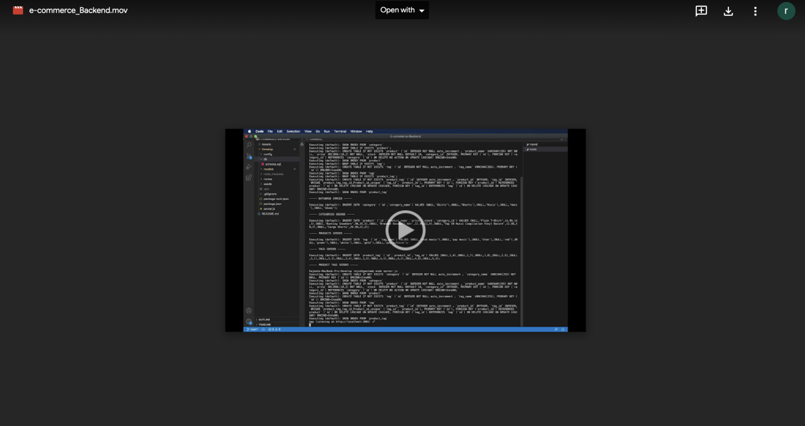

# Object-Relational Mapping (ORM): E-Commerce Back End

### Description
This is a back end for an e-commerce site which is based on CRUD operations. This site contains Express.js API and sequelize to interact with a Mysql database which includes tags, categories and products.
## Feature List:
- Node.js - Used for package managment and to execute JavaScript code to build command line tool for server-side scripting.

- MySql - Used to store all the added, updated, and modified data within the application.


The application will be invoked by typing the following  commands:
```md
npm install, 
node seeds,
npm start,
node server.js
```


## Built with:

- [Sequelize](https://www.npmjs.com/package/sequelize)

- [MySQL2 package](https://www.npmjs.com/package/mysql2)

- [dotenv](https://www.npmjs.com/package/dotenv)

- [Node.js](https://developer.mozilla.org/en-US/docs/Glossary/Node.js?retiredLocale=hu)


## Walkthrough video:

[](https://drive.google.com/file/d/1XBLhc9RPYwkY9HDXVD_7GhUzJkep2SV0/view)


## Screenshots

### Products:
 

### Tags:
  

### Categories:
  
  

## Links :


* Link for the Github repository [Host by Github](https://github.com/Rajesh295-dev/E-commerce-Backend)


## Contributor:

* [Rajesh Gautam](https://github.com/Rajesh295-dev)


- - -
 
